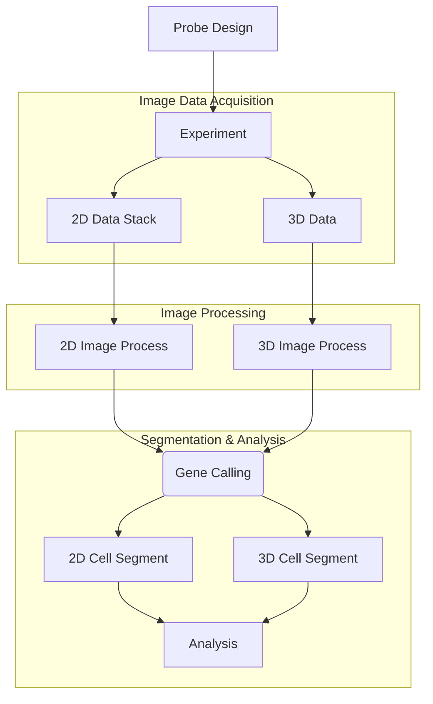

# PRISM Code

PRISM (**P**rofiling of **R**NA **I**n-situ through **S**ingle-round i**M**aging) is an innovative method that employs a radius vector code to distinguish a wide array of RNA transcripts in large-scale tissues with sub-micron resolution through a single staining and imaging cycle, making it fast and free of problems associated with traditional methods like shifting and alignment.

For more information, please read the article: [Color-barcoded Super-multiplex RNA FISH in Three-dimensional Tissues through Single-round Imaging](https://doi.org/10.1101/2024.06.29.601330).

## Table of Contents

- [Code and Pipeline Preview](#code-and-pipeline-preview)
- [Quick Start](#quick-start)
- [Data and Architecture](#data-and-architecture)
- [Tutorial](#tutorial)
  - [Probe Design](#probe-design)
  - [Image Processing 2D](#image-processing-2d)
  - [Spot Detection 2D](#spot-detection-2d)
  - [Spot Detection 3D](#spot-detection-3d)
  - [Gene Calling](#gene-calling)
  - [Cell Segmentation](#cell-segmentation)
- [Additional Resources](#additional-resources)

## Code and Pipeline Preview

The PRISM code consists of the following components: **probe_designer**, **image_process**, **gene_calling**, **cell_segmentation**, **analysis_cell_typing** and **analysis_subcellular**. Data will be processed in this order.

The pipeline can be explained as:



## Quick Start

### 1. Clone Repository

```bash
git clone --depth 1 https://github.com/HuangLab-PKU/PRISM
```

### 2. Environment Setup

#### Prerequisites
- **Python 3.8** (recommended)
- **MATLAB** with Image Processing Toolbox
- **MATLAB Engine for Python**

#### Python Dependencies

Install the required packages:

```bash
pip install -r requirements.txt
```

#### MATLAB Engine Installation

1. **Update pip and setuptools** (for MATLAB R2021b):
   ```bash
   pip install --upgrade pip setuptools==57.5.0
   ```

2. **Install MATLAB Engine API**:
   ```bash
   python -m pip install matlabengine==9.11.21
   ```

   > For other MATLAB versions, follow the [official guideline](https://www.mathworks.com/help/matlab/matlab_external/install-the-matlab-engine-for-python.html).

### 3. Choose Your Starting Point

#### Option A: Start from Stitched Images (Recommended for Beginners)

**Prerequisites:**
- Download sample data from Zenodo: [MouseEmbryo Data](https://zenodo.org/records/13219763)
- Organize data according to [Data Architecture](#data-and-architecture)

**Workflow Steps:**

1. **Signal Detection**
   ```bash
   python scripts/multi_channel_readout.py
   ```
   > Refer to the [Feature-based Spot Detection](#feature-based-spot-detection) section for detailed parameters

2. **Gene Calling**
   - Use the provided notebook: `PRISM_gene_calling_EMBRYO_30.ipynb`
   - Location: `20221219_PRISM_E13.5_2_3_Three_processed/readout/PRISM_gene_calling_EMBRYO_30.ipynb`
   - Example output: `20221219_PRISM_E13.5_2_3_Three_processed/readout/Manual_publication`

3. **Cell Segmentation**
   ```bash
   python scripts/segment_dapi.py
   python scripts/segment_cell_2D.py
   ```

**Expected Outputs:**
- `mapped_genes.csv`: RNA spots with spatial coordinates and gene assignments
- `dapi_centroids.csv`: Cell nucleus centroids from DAPI segmentation
- `expression_matrix.csv`: Cell-by-gene expression count matrix

**Example file paths:**
- `20221219_PRISM_E13.5_2_3_Three_processed/readout/mapped_genes.csv`
- `20221219_PRISM_E13.5_2_3_Three_processed/segmented/expression_matrix.csv`

#### Option B: Start from Raw Unstitched Images (Full Pipeline)

**Prerequisites:**
- Download raw data from [HCC Raw Images](https://disk.pku.edu.cn/link/AA382E67AE9779469C97814C27892A43DF)
  > Note: Large files may require multiple downloads due to bandwidth limits
- Organize data according to [Data Architecture](#data-and-architecture)

**Workflow Steps:**

1. **Image Processing**
   ```bash
   python scripts/image_process_pipeline.py
   ```

2. **Signal Detection**
   ```bash
   python scripts/multi_channel_readout.py
   ```

3. **Gene Calling**
   - Use the provided notebook: `PRISM_gene_calling_2d_HCC.ipynb`
   - Location: `20230523_HCC_PRISM_probe_refined_processed/readout/PRISM_gene_calling_2d_HCC.ipynb`

4. **Cell Segmentation**
   ```bash
   python scripts/segment_dapi.py
   python scripts/segment_cell_2D.py
   ```

**Expected Outputs:**
- `mapped_genes.csv`: Decoded RNA spots with spatial coordinates and gene assignments
- `dapi_centroids.csv`: Cell nucleus centroids from DAPI segmentation
- `expression_matrix.csv`: Cell-by-gene expression count matrix

**Example file paths:**
- `20230523_HCC_PRISM_probe_refined_processed/readout/manual_publication/mapped_genes.csv`
- `20230523_HCC_PRISM_probe_refined_processed/segmented/expression_matrix.csv`

## Data and Architecture

### How to Get Our Data

Stitched raw images are provided on zenodo.org, download based on your needs:

1. [MouseEmbryo](https://zenodo.org/records/13219763)
2. [HCC](https://zenodo.org/records/13208941)
3. [MouseBrain3D](https://zenodo.org/records/12673246)
4. [Cell typing and Analysis](https://zenodo.org/records/12755414)

We also provide **HCC2D** unstitched raw images on [PKU NetDisk](https://disk.pku.edu.cn/link/AA83FADBB90EB14BAE8E9DE5889E94AFF9) (you may need to download the tiles in cyc_1_zip in multiple batches due to bandwidth limits). Download them and decompress the images using the provided script.

**For more raw data, contact us: huanglab111@gmail.com.**

### Data Architecture

Raw data base directory and processed data output directory can be wherever you need. However, subdirectories should follow this structure:

```shell
Raw data root
├─RUN_ID1
│  └─cyc1
│     ├─C001-T0001-cy3-Z000.tif
│     ├─C001-T0001-cy3-Z001.tif
│     ├─...
│     ├─C001-T0004-FAM-Z006.tif
│     ├─...
│     └─C001-T0108-TxRed-Z008.tif
├─RUN_ID2
├─...
└─RUN_IDN
```

```shell
Output root
├─RUN_ID1_processed        # auto-created
│  ├─focal_stacked         # auto-created
│  ├─background_corrected  # auto-created, deleted after image processing
│  ├─resized               # auto-created, deleted after image processing
│  ├─registered            # auto-created
│  ├─stitched              # auto-created
│  ├─segmented             # auto-created
│  └─readout               # auto-created
├─RUN_ID2_processed        # auto-created
├─...
└─RUN_IDN_processed        # auto-created
```

Your raw data should be in folder `RUN_ID`.

Important results of each step are stored in corresponding directories under `RUN_ID_processed`. In this example, step directories are defined as:

```shell
# In image process
dest_dir = BASE_DIR / f'{RUN_ID}_processed' # processed data
aif_dir = dest_dir / 'focal_stacked'        # scan_fstack.py
sdc_dir = dest_dir / 'background_corrected' # image_process_after_stack.py
rsz_dir = dest_dir / 'resized'              # image_process_after_stack.py
rgs_dir = dest_dir / 'registered'           # image_process_after_stack.py
stc_dir = dest_dir / 'stitched'             # image_process_after_stack.py

# In following analysis
src_dir = BASE_DIR / f'{RUN_ID}_processed'  # processed data
stc_dir = src_dir / 'stitched'              # image_process_after_stack.py
read_dir = src_dir / 'readout'              # multi_channel_readout.py
seg_dir = src_dir / 'segmented'             # segment2D.py or segment3D.py or expression_matrix.py
visual_dir = src_dir / 'visualization'      # folder for figures...
```

## Tutorial

**⚠️ Important:** Many paths or directories need editing in files mentioned below.

We provide Jupyter notebooks to demonstrate how to use PRISM for analysis. The notebooks are located in the `notebooks` folder.

### Probe Design

This step is not always necessary because you can design probes with specific binding sites, barcodes and corresponding fluorophore probes manually or contact us for help. However, if you want to design probes easily or in bulk, see: [probe_designer](https://github.com/tangmc0210/probe_designer).

---

### Image Processing 2D

Steps 1 and 2 are used to generate a complete image for each channel used in the experiment. If you have other methods to perform this image processing, store the name of each channel's image as `cyc_1_channel.tif`.

#### Step 1: Scan_fstack

Edit the directory in the Python file `scan_fstack.py` and run the code:

```shell
python scripts/scan_fstack.py Raw_data_root
```

**Remark**: This step processes raw images captured in small fields and multiple channels. You can use it to process your own experimental data. We have provided a preprocessed example dataset for Step 2 and subsequent pipeline steps, located at `./dataset/processed/_example_dataset_processed`. You can change the RUN_ID in each script to `_example_dataset` and continue with the following steps.

#### Step 2: Image_process

Edit the directory in the Python file `image_process/image_process_after_stack.py` accordingly, and run the code:

```shell
python scripts/image_process_after_stack.py
```

**Remark**: This step includes registering the subimages, correcting the background, and stitching them into a whole image. Results will be stitched into n big images (where n is the number of channels you use) in `stc_dir`, which will be used in the next part.

#### 3D Reconstruction of 2D Images

**TODO**

If your images are captured as mentioned in [Data Architecture](#data-and-architecture) above and you want to restore the z-stack information (even if only 10μm), change the parameters file path in `pipeline_3D.py` and run:

```shell
python pipeline_3D.py
```

to read the intensity from raw images.

**Remark**: This pipeline includes 2D processing as cycle shift and global position of each tile is needed from the 2D pipeline. After that, airlocalize is performed to extract spots in 3D (z-stack number as the depth). Remember to change the parameters file path and adjust the parameters for your own data before running the code.

### Spot Detection 2D

#### Feature-based Spot Detection

Edit the directory in the Python file `scripts/multi_channel_readout.py` accordingly, and run the code:

```shell
python scripts/multi_channel_readout.py
```

**Remark**: This step requires stitched big images generated in the previous step. Signal spots and their intensity can be extracted using `scripts/multi_channel_readout.py`. It will generate two CSV files named `tmp/intensity_all.csv` and `intensity_all_deduplicated.csv` in the directory `RUN_IDx_processed/readout/` and copy the .py file to the readout path as well.

#### Deep Learning Based Spot Detection (Recommended)

This updated workflow uses a StarDist deep learning model to detect spots from multi-channel images, providing higher accuracy and avoiding the issue of duplicate detections for spots that appear in multiple channels.

##### Step 1: Prepare Training Data

The most critical step is to create high-quality training data. This involves annotating your images to teach the model what a "spot" looks like.

1. **Understand the Data Structure**:
   - Your training images should be placed in `data/training/images/`. These must be **multi-channel TIFF files**, with the shape `(channels, height, width)`.
   - Your corresponding masks go in `data/training/masks/`. These must be **single-channel TIFF files** where each individual spot is "painted" with a unique integer ID (1, 2, 3, ...). The background must be 0.

2. **Annotate Your Images**:
   - We highly recommend using **Fiji/ImageJ** with the **Labkit** plugin for this task.
   - Load your multi-channel image into Fiji, then open it in Labkit.
   - On a single label layer, carefully paint over every unique spot you see across all channels. Labkit will automatically assign a unique ID to each disconnected spot you paint.
   - For spots that are very close, ensure their masks do not touch. Use the eraser tool or the Watershed method to create a 1-pixel separation.
   - Export the final annotation from Labkit using `Save > Export Labeling as Tiff...` and save it as an `Unsigned 16-bit` TIFF.
   - For more detailed instructions, see the guide in `src/spot_detection/README.md`.

##### Step 2: Train the Model

Once you have prepared at least 10-20 annotated image/mask pairs, you can train the model.

- Run the training script from your terminal:
  ```bash
  python scripts/train_spot_detector.py --use-gpu
  ```
- This will use the data in `data/training/`, train a new model, and save it to the `models/` directory. You can adjust training parameters like epochs and patch size directly in the command line. Run `python scripts/train_spot_detector.py --help` for more options.

##### Step 3: Run Inference

After the model is trained, you can use it to detect and quantify spots in new, unseen images.

- Run the inference script, providing the path to your images and where to save the output:
  ```bash
  python scripts/multi_channel_readout_dp.py \
      --input-dir /path/to/your/stitched/images \
      --output-csv /path/to/your/readout/results.csv \
      --channel-files cyc_1_cy5.tif cyc_1_TxRed.tif cyc_1_cy3.tif cyc_1_FAM.tif \
      --channels cy5 TxRed cy3 FAM
  ```
- This script will:
  1. Load your trained StarDist model from the `models/` directory.
  2. Combine your single-channel images into a multi-channel stack.
  3. Detect all unique spots.
  4. For each spot, fit a 2D Gaussian to measure its integrated intensity and local background in every channel.
  5. Save the results to a `.csv` file, with columns like `Y`, `X`, `cy5_intensity`, `cy5_background`, etc.

### Spot Detection 3D

If your images are captured by confocal, light-sheet or any other 3D microscopy and you have a registered and stitched grayscale 3D image of each channel in TIFF format:

We recommend using [AIRLOCALIZE](https://github.com/timotheelionnet/AIRLOCALIZE) in MATLAB to perform spot extraction because of its well-designed user interface for adjusting proper parameters. Open MATLAB and run `AIRLOCALIZE.m` in `src/Image_process/lib/AIRLOCALIZE-MATLAB`. The input files should be located at `path_to_runid/RUN_ID_processed/stitched` and the output path should be `path_to_runid/RUN_ID_processed/readout/tmp`.

> Alternatively, spot extraction can be performed using airlocalize.py with proper parameters (set at `Image_process\lib\AIRLOCALIZE\parameters.yaml`).
>
> ```shell
> python image_process/lib/AIRLOCALIZE/airlocalize.py
> ```
>
> **Remarks**:
>
> - The default image axis is 'XYZ' in airlocalize. If you need other axis orders like 'ZXY', please use `np.transpose()` in the previous step or modify the `self.retrieve_img()` function in `Image_process/lib/AIRLOCALIZE/airlocalize_data.py`.
>
> - AIRLOCALIZE includes pre-detection of signal spots on a feature image (like DoG, LoG or Gaussian smoothed) and fits the accurate location and intensity of spots on the original image. Important parameters include:
>
> ```yaml
> # scaling
> scale: scale the image to drop too low or too high spots.
> scaleMaxRatio: the final absolute upper bound of scaled image, don't set it to 1 to prevent excess of np.uint16 and cause errors.
>
> # predetection
> featureExtract: feature image method, LoG is thought best while it takes relatively high calculation resources. DoG with properly set filterLo and filterHi can be seen as a similar replacement.
> ThreshLevel: list, different channels can be set differently. The higher, the fewer points detected.
> maxSpots: predetected spots number, obtained by selecting the first 'maxSpots' spots sorted by intensity from high to low.
>
> # Gaussian fit
> Psfsigma: the sigma of your gaussian-like signal points, determined by your real data.
> ```

After that, intensity decoding and gene calling can be performed using `gene_calling\readout_gene_calling_3d.ipynb`.

---

### Gene Calling

In this part, we recommend using `gene_calling/gene_calling_GMM.ipynb` when you have `readout/intensity.csv` because spots distribution in color space may differ between tissue types or cameras. For a quick start, you can also use `gene_calling/gene_calling_GMM.py` by editing the directory in the Python file `gene_calling/gene_calling_GMM.py` and running the code:

```shell
python scripts/gene_calling_GMM.py
```

The result should be at `read_dir/mapped_genes.csv` by default.

**Remark**:

- Gene calling for PRISM is performed by a Gaussian Mixture Model, manual selection by masks, and evaluation of the confidence of each spot. It's expected to run on a GUI because some steps need human knowledge of the experiments, such as how the chemical environment or FRET would affect the fluorophores.

- You can also use `gene_calling/PRISM_gene_calling_GMM.ipynb` for customization or use `gene_calling/gene_calling_manual.ipynb` to set the threshold for each gene manually.

- 3D gene calling in our article was performed in `gene_calling\PRISM3D_intensity_readout_and_gene_calling.ipynb`.

For more details, see [PRISM_gene_calling](https://github.com/tangmc0210/PRISM_gene_calling).

### Cell Segmentation

#### DAPI Centroids

Edit the directory in the Python file `cell_segmentation/segment2D.py` or `cell_segmentation/segment3D.py` and run:

```shell
python scripts/segment2D.py
```

or

```shell
python scripts/segment3D.py
```

This code will segment cell nuclei according to the DAPI channel. A CSV file containing the coordinates of nucleus centroids will be generated in `seg_dir` as `centroids_all.csv`.

#### Expression Matrix

Edit the directory in the Python file `gene_calling/expression_matrix.py`, and run:

```shell
python scripts/expression_matrix2D.py
```

or

```shell
python scripts/expression_matrix3D.py
```

The expression matrix will be generated in `seg_dir` as `expression_matrix.csv`.

**Remarks**:

- `Segmentation3D.py` needs a StarDist environment as it uses a trained network to predict the shape and centroid of nuclei in 3D. For more information, see: [StarDist](https://github.com/stardist/stardist).
- Our strategy to generate expression matrices generally assigns RNA to its nearest centroid of cell nucleus (predicted by DAPI), so it requires `dapi_centroids.csv` of cell nuclei and `mapped_genes.csv` generated in previous steps. If you have other strategies that perform better on your data, you can replace this step with them.

---

## Additional Resources

- For probe design: [probe_designer](https://github.com/tangmc0210/probe_designer)
- For 3D segmentation: [StarDist](https://github.com/stardist/stardist)
- For 3D spot detection: [AIRLOCALIZE](https://github.com/timotheelionnet/AIRLOCALIZE)

For questions or support, contact us at: **huanglab111@gmail.com**