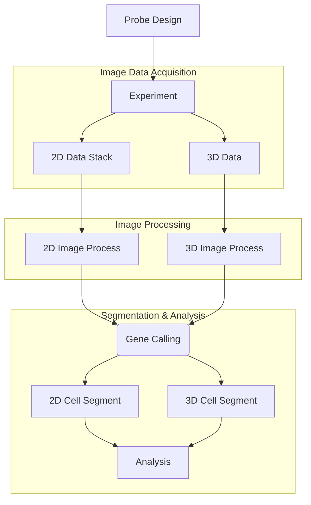

# PRISM Code

PRISM (**P**rofiling of **R**NA **I**n-situ through **S**ingle-round i**M**aging) is an innovative method that employs a multi-channel color barcoding to distinguish a wide array of RNA transcripts in large-scale tissues with sub-micron resolution through a single staining and imaging cycle, making it fast and free of problems associated with fluidics-dependency and inter-round spot shift.

For more information, please read the article: 
- [BioArxiv 2024.6.29](https://doi.org/10.1101/2024.06.29.601330).

This repository provides a comprehensive computational pipeline for PRISM data analysis, including image processing, spot detection, gene calling, and cell segmentation. The codebase supports both 2D and 3D spatial transcriptomics analysis with modular, configurable components that can be adapted to different experimental setups and tissue types.

## Documentation

For detailed documentation, please refer to the [docs](docs/) directory:

- **[Quick Start](docs/quick_start.md)** - Get started quickly
- **[Installation Guide](docs/installation.md)** - Complete installation instructions
- **[Detailed Usage Guide](docs/detailed_usage.md)** - Comprehensive workflow documentation
- **[Configuration Guide](docs/configuration.md)** - Parameter configuration
- **[Data Architecture](docs/data_architecture.md)** - Data structure requirements
- **[Changelog](docs/changelog.md)** - Project change history

## Quick Start

For detailed setup and usage instructions, see the [Quick Start Guide](docs/quick_start.md).

**Basic Setup:**
```bash
git clone --depth 1 https://github.com/HuangLab-PKU/PRISM
cd PRISM/code
pip install -r requirements.txt
```

**Prerequisites:**
- Python 3.8+ with MATLAB Engine for Python
- MATLAB with Image Processing Toolbox

## Complete Workflow Overview

The PRISM code consists of the following components: **probe_designer**, **image_process**, **gene_calling**, **cell_segmentation**, **analysis_cell_typing** and **analysis_subcellular**. Data will be processed in this order.



## Data Sources

Stitched raw images are provided on zenodo.org, download based on your needs:

1. [MouseEmbryo](https://zenodo.org/records/13219763)
2. [HCC](https://zenodo.org/records/13208941)
3. [MouseBrain3D](https://zenodo.org/records/12673246)
4. [Cell typing and Analysis](https://zenodo.org/records/12755414)

We also provide **HCC2D** unstitched raw images on [PKU NetDisk](https://disk.pku.edu.cn/link/AA83FADBB90EB14BAE8E9DE5889E94AFF9).

**For more raw data, contact us: huanglab111@gmail.com.**

## Additional Resources

- For probe design: [probe_designer](https://github.com/tangmc0210/probe_designer)
- For 3D segmentation: [StarDist](https://github.com/stardist/stardist)
- For 3D spot detection: [AIRLOCALIZE](https://github.com/timotheelionnet/AIRLOCALIZE)

For questions or support, contact us at: **huanglab111@gmail.com**