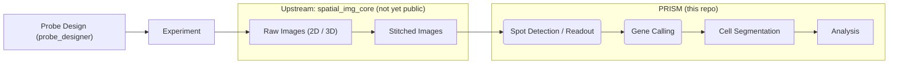

# PRISM Code

PRISM (**P**rofiling of **R**NA **I**n-situ through **S**ingle-round i**M**aging) is an innovative method that employs a multi-channel color barcoding to distinguish a wide array of RNA transcripts in large-scale tissues with sub-micron resolution through a single staining and imaging cycle, making it fast and free of problems associated with fluidics-dependency and inter-round spot shift.

For more information, please read the article: 
- [Nature Biotechnology 2025.10.30](https://doi.org/10.1038/s41587-025-02883-7)
- [bioRxiv 2024.6.29](https://doi.org/10.1101/2024.06.29.601330).

This repository provides the **post-stitching** computational pipeline for PRISM: spot detection, gene calling, and cell segmentation on stitched PRISM images (2D and 3D). Image acquisition — focal stacking, illumination correction, registration, stitching — is handled by the companion package `spatial_img_core` (**not yet public**; request access at huanglab111@gmail.com). The codebase is modular and configurable for different experimental setups and tissue types.

## Documentation

For detailed documentation, please refer to the [docs](docs/) directory:

- **[Quick Start](docs/quick-start.md)** - Get started quickly
- **[Installation Guide](docs/installation.md)** - Complete installation instructions
- **[Detailed Usage Guide](docs/detailed-usage.md)** - Comprehensive workflow documentation
- **[Configuration Guide](docs/configuration.md)** - Parameter configuration
- **[Data Architecture](docs/data-architecture.md)** - Data structure requirements
- **[Changelog](docs/changelog.md)** - Project change history

## Quick Start

For detailed setup and usage instructions, see the [Quick Start Guide](docs/quick-start.md).

**Basic Setup:**
```bash
git clone https://github.com/HuangLab-PKU/PRISM-Code
cd PRISM-Code
pip install -e .
```

**Prerequisites:**
- Python 3.10+
- (Optional) GPU for StarDist segmentation or PoSTcode gene calling — see [installation guide](docs/installation.md)
- (Optional) `spatial_img_core` for the upstream raw-image → stitched-image steps. It is **not yet public**; request access from the authors at **huanglab111@gmail.com**.

## Complete Workflow Overview

The PRISM code consists of the following post-stitching components: **readout**, **gene_calling**, **cell_segmentation**, and downstream **analysis** (cell typing, subcellular). Upstream steps (probe design → experiment → raw images → stitched images) are handled by the [`probe_designer`](https://github.com/tangmc0210/probe_designer) and `spatial_img_core` packages. `probe_designer` is public; `spatial_img_core` is **not yet public** — request access at **huanglab111@gmail.com**.


```mermaid
graph LR
    A["Probe Design (probe_designer)"] --> B["Experiment"];
    B --> C["Raw Images (2D / 3D)"];

    subgraph "Upstream: spatial_img_core (not yet public)"
        C --> D["Stitched Images"];
    end

    subgraph "PRISM (this repo)"
        D --> E("Spot Detection / Readout");
        E --> F("Gene Calling");
        F --> G["Cell Segmentation"];
        G --> H["Analysis"];
    end
```

## Data Sources

Stitched raw images are provided on zenodo.org, download based on your needs:

1. [MouseEmbryo](https://zenodo.org/records/13219763)
2. [HCC](https://zenodo.org/records/13208941)
3. [MouseBrain3D](https://zenodo.org/records/12673246)
4. [Cell typing and Analysis](https://zenodo.org/records/12755414)

We also provide **HCC2D** unstitched raw images on [PKU NetDisk](https://disk.pku.edu.cn/link/AA83FADBB90EB14BAE8E9DE5889E94AFF9).

**For more raw data, contact us: huanglab111@gmail.com.**

## Additional Resources

- For image acquisition (focal stacking, illumination correction, registration, stitching): `spatial_img_core` — not yet public, request access at **huanglab111@gmail.com**
- For probe design: [probe_designer](https://github.com/tangmc0210/probe_designer)
- For 3D segmentation: [StarDist](https://github.com/stardist/stardist)
- For 3D spot detection: [AIRLOCALIZE](https://github.com/timotheelionnet/AIRLOCALIZE) (invoked through `spatial_img_core`)

For questions or support, contact us at: **huanglab111@gmail.com**