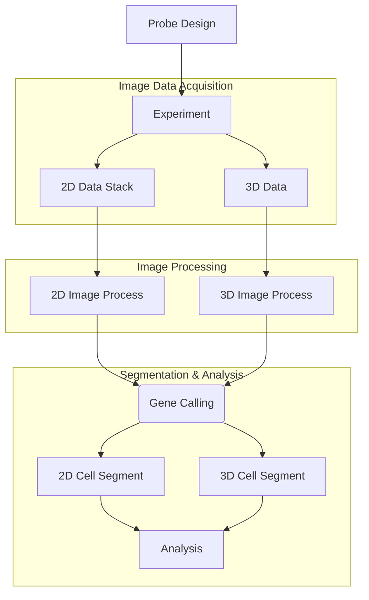

# Quick Start

## Complete Workflow Overview

The PRISM code consists of the following components: **probe_designer**, **image_process**, **gene_calling**, **cell_segmentation**, **analysis_cell_typing** and **analysis_subcellular**. Data will be processed in this order.



## Quick Start Options

### Option A: Start from Stitched Images (Recommended for Beginners)

**Prerequisites:**
- Download sample data from Zenodo: [MouseEmbryo Data](https://zenodo.org/records/13219763)
- Organize data according to [Data Architecture](data_architecture.md)

**Workflow Steps:**

1. **Signal Detection**
   ```bash
   python scripts/multi_channel_readout.py
   ```

2. **Gene Calling**
   - Use the provided notebook: `PRISM_gene_calling_EMBRYO_30.ipynb`
   - Location: `20221219_PRISM_E13.5_2_3_Three_processed/readout/PRISM_gene_calling_EMBRYO_30.ipynb`

3. **Cell Segmentation**
   ```bash
   python scripts/segment_dapi.py
   python scripts/segment_cell_2D.py
   ```

**Expected Outputs:**
- `mapped_genes.csv`: RNA spots with spatial coordinates and gene assignments
- `dapi_centroids.csv`: Cell nucleus centroids from DAPI segmentation
- `expression_matrix.csv`: Cell-by-gene expression count matrix

### Option B: Start from Raw Unstitched Images (Full Pipeline)

**Prerequisites:**
- Download raw data from [HCC Raw Images](https://disk.pku.edu.cn/link/AA382E67AE9779469C97814C27892A43DF)
- Organize data according to [Data Architecture](data_architecture.md)

**Workflow Steps:**

1. **Image Processing**
   ```bash
   python scripts/image_process_pipeline.py
   ```

2. **Signal Detection**
   ```bash
   python scripts/multi_channel_readout.py
   ```

3. **Gene Calling**
   - Use the provided notebook: `PRISM_gene_calling_2d_HCC.ipynb`
   - Location: `20230523_HCC_PRISM_probe_refined_processed/readout/PRISM_gene_calling_2d_HCC.ipynb`

4. **Cell Segmentation**
   ```bash
   python scripts/segment_dapi.py
   python scripts/segment_cell_2D.py
   ```

## Data Acquisition

Stitched raw images are provided on zenodo.org, download based on your needs:

1. [MouseEmbryo](https://zenodo.org/records/13219763)
2. [HCC](https://zenodo.org/records/13208941)
3. [MouseBrain3D](https://zenodo.org/records/12673246)
4. [Cell typing and Analysis](https://zenodo.org/records/12755414)

We also provide **HCC2D** unstitched raw images on [PKU NetDisk](https://disk.pku.edu.cn/link/AA83FADBB90EB14BAE8E9DE5889E94AFF9).

**For more raw data, contact us: huanglab111@gmail.com.**

## Refactored Multi-Channel Readout (Optional)

For users who want to use the refactored, more modular version of the multi-channel readout script:

### Basic Usage

```python
from scripts.multi_channel_readout_refactored import MultiChannelProcessor

# Process single dataset with default configuration
processor = MultiChannelProcessor(run_id='20250717_FFPE_OSCC')
intensity = processor.process_single_run()
```

### Command Line Usage

```bash
# Single file processing
python scripts/multi_channel_readout_refactored.py
```

## Next Steps

- View [Detailed Usage Guide](detailed_usage.md) for comprehensive workflow instructions
- Understand [Data Architecture](data_architecture.md) requirements
- Refer to [Installation Guide](installation.md) for environment setup
- Check [Tutorial](tutorial.md) for step-by-step operations
- Explore [Configuration Guide](configuration.md) for parameter customization